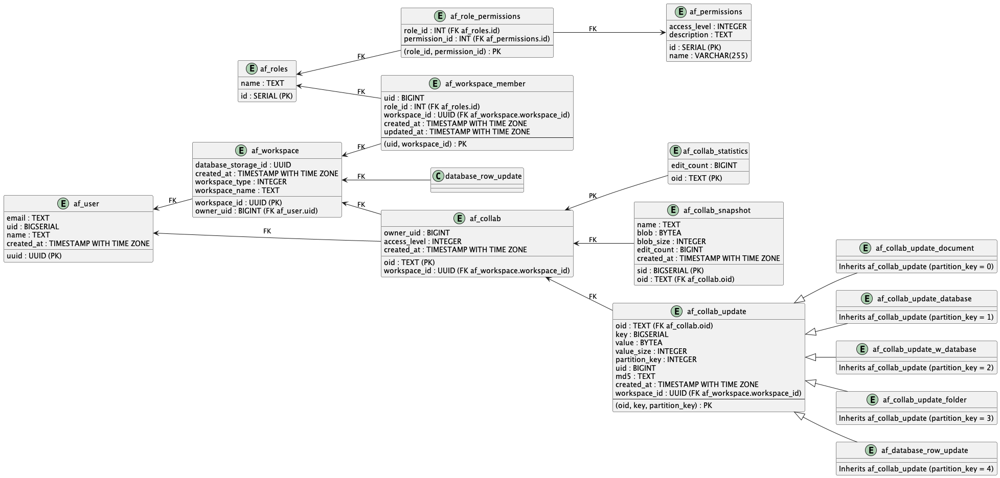

# AppFlowy Supabase Integration

This repository furnishes tools that facilitate the configuration of required tables, migrations, and triggers in a Supabase PostgreSQL database, thereby ensuring seamless integration of AppFlowy with Supabase.

## Table of Contents

- [Supabase Configuration](#supabase-configuration)
- [Executing Migrations](#executing-migrations)
- [Understanding the Table Schema](#understanding-the-table-schema)

### Supabase Configuration

It's crucial to appropriately configure the `.env` files based on distinct environments: `.env.dev`, `.env.test`, and `.env.prod`.

```dotenv
SUPABASE_DB=db.xxxxxxx.supabase.co
SUPABASE_DB_USER=postgres
SUPABASE_DB_PORT=6543
SUPABASE_DB_PASSWORD=xxxxxxx
```

- **`SUPABASE_DB`**: Database URL for the Supabase instance.

- **`SUPABASE_DB_USER`**: Username for Supabase database authentication. Typically, this is set to 'postgres' – a common default for PostgreSQL.

- **`SUPABASE_DB_PORT`**: The port on which the Supabase database is accessible. The conventional PostgreSQL port is 5432.

- **`SUPABASE_DB_PASSWORD`**: Password corresponding to the `SUPABASE_DB_USER`.

### Executing Migrations


#### Step 1: Clone the Repository

```shell
git clone https://github.com/AppFlowy-IO/AppFlowy-Supabase
```

#### Step 2: Create the Environment File

Create the `.env` file in the root directory of the repository. Makesure  to set the environment variables as described in the [Supabase Configuration](#supabase-configuration) section.


#### Step 3: Run the migrations

```shell
cargo run migration run ".env"
```

To reset the database, which entails deleting all existing tables, triggers, and functions, and then re-running the migrations:

```shell
cargo run database reset ".env"
```

> **Note**: For safety, the `.env.prod` file is designed to disallow the database reset command. This acts as a safeguard against unintentional deletion of the production database.

### Understanding the Table Schema



1. **`af_roles` table**: Captures roles, e.g., 'Owner', 'Member', 'Guest'.

2. **`af_permissions` table**: Chronicles permissions, each featuring a name, description, and access tier.

3. **`af_role_permissions` table**: A junction table representing permissions assigned to roles.

4. **`af_user` table**: Houses user details, including a unique identifier (uid).

5. **`af_workspace` table**: Lists workspaces, each linked to a user via the user's uid.

6. **`af_workspace_member` table**: Associates members with their workspaces and respective roles.

7. **`af_collab` & `af_collab_member` tables**: Denote collaborations and their constituent members.

8. **Update tables**: (`af_collab_update`, `af_collab_update_document`, etc.): Handle collaboration updates.

9. **Statistics & snapshot tables**: (`af_collab_statistics`, `af_collab_snapshot`, `af_collab_state`): Track collaboration metrics and snapshots.

10. **`af_user_profile_view` view**: Fetches the latest workspace_id for every user.

---